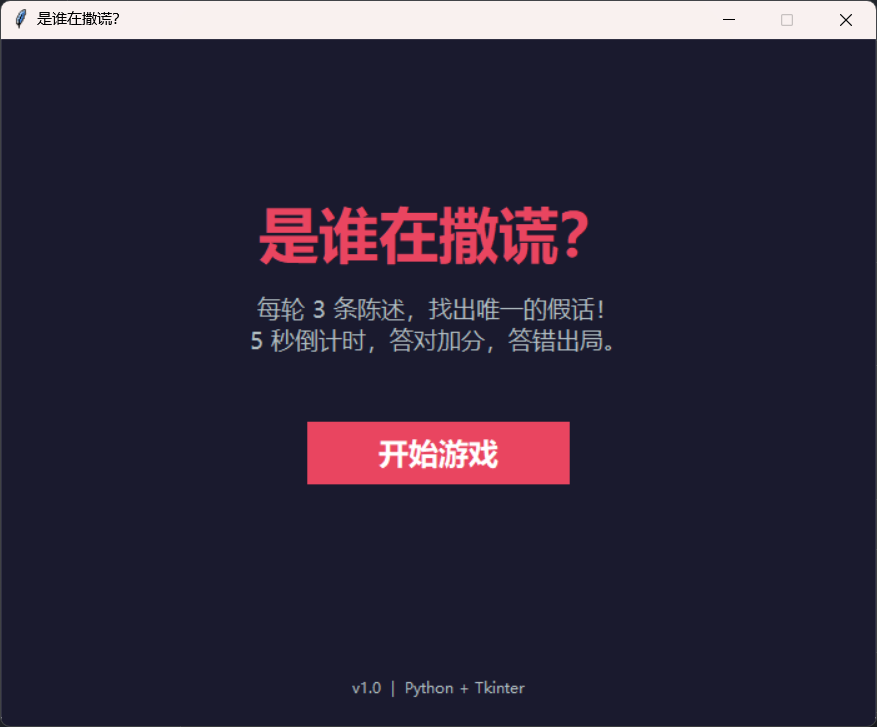
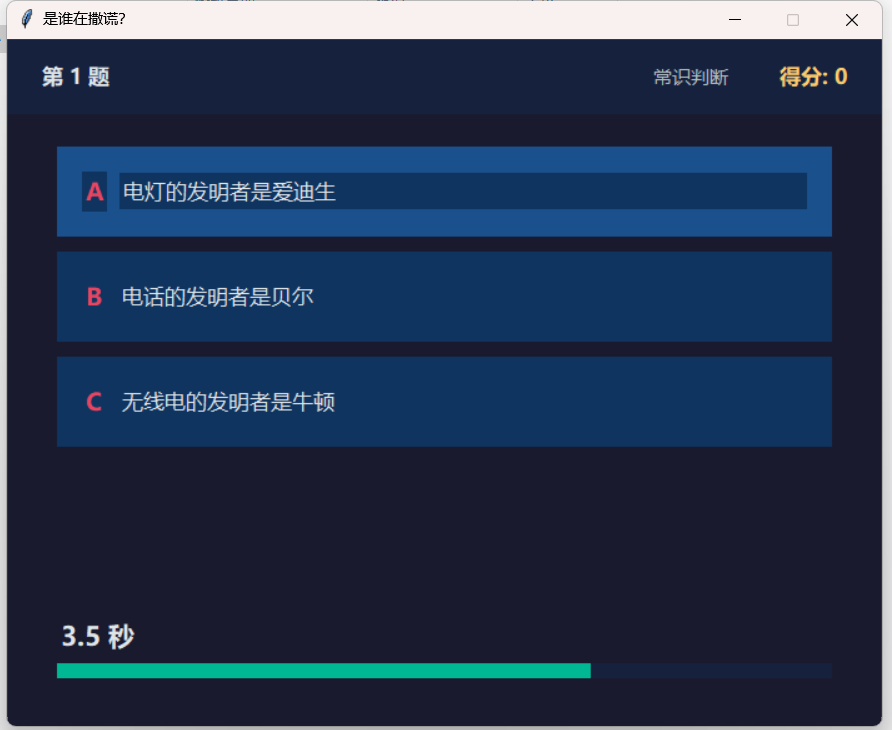
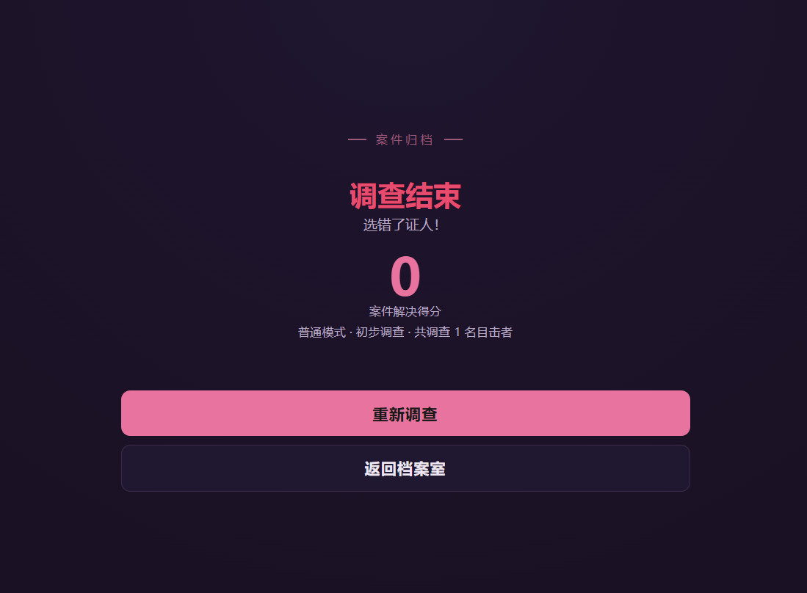

# 是谁在撒谎？

PC 桌面推理小游戏 — 找出唯一的假话，在倒计时结束前做出选择。

## 在线试玩

**[ajun-520.github.io/WhoIsLying](https://ajun-520.github.io/WhoIsLying/)**

纯 HTML/CSS/JS 网页版，无需下载，手机和电脑都能玩。

## 手机安装（PWA）

支持添加到手机主屏幕，像原生 App 一样使用：

- **Android / Chrome**：打开网页 → 浏览器菜单 → "添加到主屏幕" 或 "安装应用"
- **iOS / Safari**：打开网页 → 底部分享按钮 → "添加到主屏幕"
- 安装后支持**离线游玩**，无需网络

## 电脑下载

在 [GitHub Releases](https://github.com/ajun-520/WhoIsLying/releases) 页面下载：

- **WhoIsLying_v1.0.0.zip**（推荐，解压即玩）
- **WhoIsLying.exe**（直接运行）

双击运行，无需安装 Python。

> **安全提示**：由于 exe 未购买数字签名证书（个人开发者每年需 $200+），下载时浏览器或 Windows 可能提示"无法验证发布者"或"Windows 已保护你的电脑"。这是正常现象，并非病毒。
>
> **解决方法**：
> 1. 下载 `.zip` 版本，解压后运行（有时可绕过 SmartScreen）
> 2. 如提示"Windows 已保护你的电脑"→ 点击 **"更多信息"** → 点击 **"仍要运行"**
> 3. 如浏览器阻止下载 → 选择 **"保留"** 或 **"另存为"**

```bash
# 源码运行
python main.py

# 或直接运行打包好的 exe
dist/是谁在撒谎.exe
```

纯 Python + tkinter 实现，无第三方依赖。

## 游戏截图

| 开始画面 | 游戏中 | 结算画面 |
|---------|--------|---------|
|  |  |  |

## 游戏规则

每轮显示 **3 条陈述**，其中恰好 **1 条为假**。玩家需在倒计时结束前点选假话：

- 答对：+10 分，自动进入下一题
- 答错或超时：游戏结束，显示最终得分

## 难度递进

| 关卡 | 阶段 | 题目类型 | 限时 |
|------|------|----------|------|
| 1~5 | 常识判断 | 3 条常识陈述（70 组题库） | 5~8 秒 |
| 6~10 | 逻辑推理 | 3 人逻辑谜题（6 种模板随机） | 5~10 秒 |
| 11+ | 高难挑战 | 40% 常识 + 60% 四人逻辑题（4 种模板） | 4~12 秒 |

## 双模式

- **普通模式**：时间充裕（常识 8s / 逻辑 10s / 高难 12s），适合休闲推理
- **挑战模式**：极限反应（常识 5s / 逻辑 5s / 高难 4s），适合硬核玩家

## 三套主题

进入游戏后可在首页切换：

- **经典侦探**（金色）— 中性风格
- **暗夜追踪**（蓝色）— 偏男性风格
- **蔷薇推理**（粉色）— 偏女性风格

## 项目结构

```
是谁在撒谎？/
├── index.html           # 网页版（GitHub Pages）
├── manifest.json        # PWA 清单
├── sw.js                # Service Worker（离线缓存）
├── icon-192.png         # PWA 图标
├── icon-512.png         # PWA 图标
├── icon-180.png         # iOS 图标
├── main.py              # 桌面版入口
├── game_engine.py       # 游戏引擎：题库、题目生成、计分
├── game_ui.py           # 桌面版 UI（tkinter）
├── screenshots/         # 游戏截图
└── dist/
    └── 是谁在撒谎.exe    # 打包后的独立可执行文件
```

## 打包

```bash
pip install pyinstaller
pyinstaller --onefile --windowed --name "是谁在撒谎" main.py
```

输出文件在 `dist/` 目录下。
